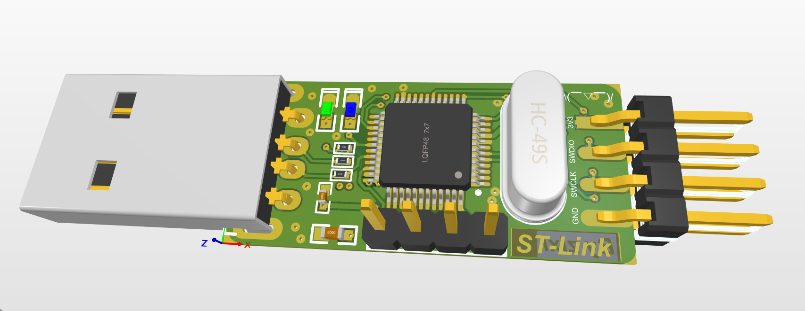
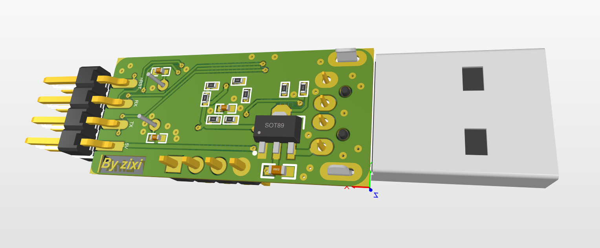
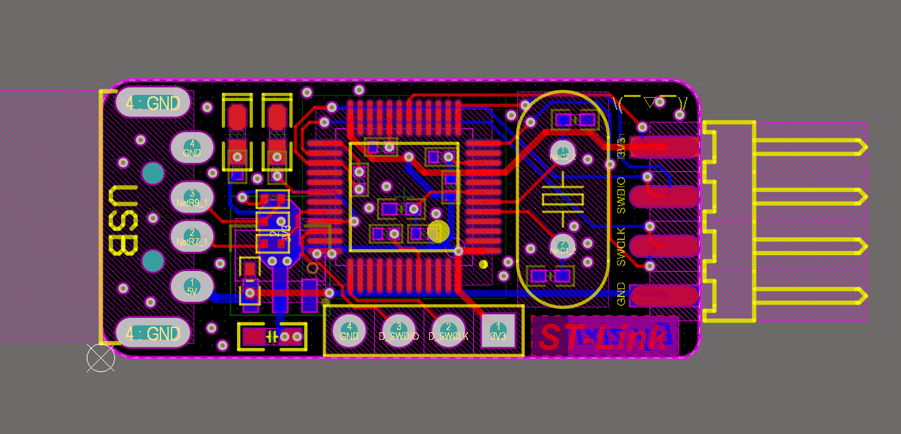
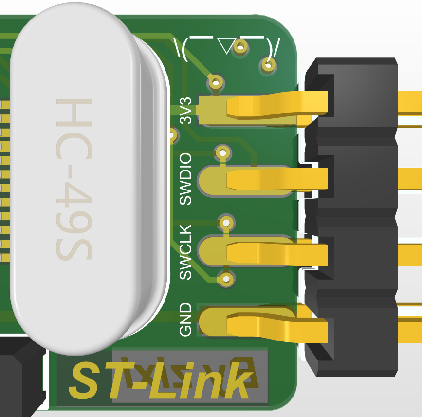
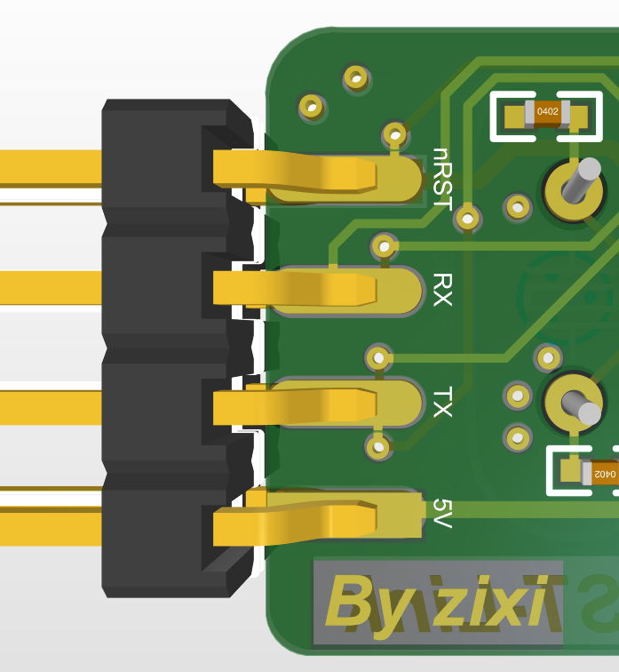

# ST-Link
>自制ST-Link模块

期末考试期间时间紧张一些，之前在做的NFC卡小项目遇到一些困难一直鸽着，所以最近抽了零散的空闲时间仿照ST-NUCLEO开源原理图，制作了这个ST-Link。

下载器主控用的是STM32F103CBT6，板子上引出了UART接口，可以同时完成ST-Link以及串口通信功能。

## 使用说明

板子上下排4个针脚是SWD下载接口，用于给主控烧录程序使用，板子上面没有写接口丝印，详见Hareware中的原理图部分。焊接PCB后，使用另外的ST-Link通过下端的4脚SWD接口给板子下载Bootloader固件，然后通过Tools中的ST-LinkUpgrade进行固件升级即可。Firmware中我提供了多个Bootloader，大家在其中选择其一烧录即可。

## 接口说明

接口功能见下图

## 实物展示

>功能验证正常

### wish you enjoy~ 如果有帮助的话，可以给仓库点一颗星星，蟹蟹